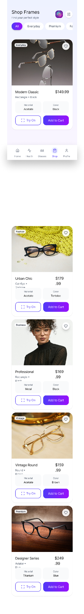
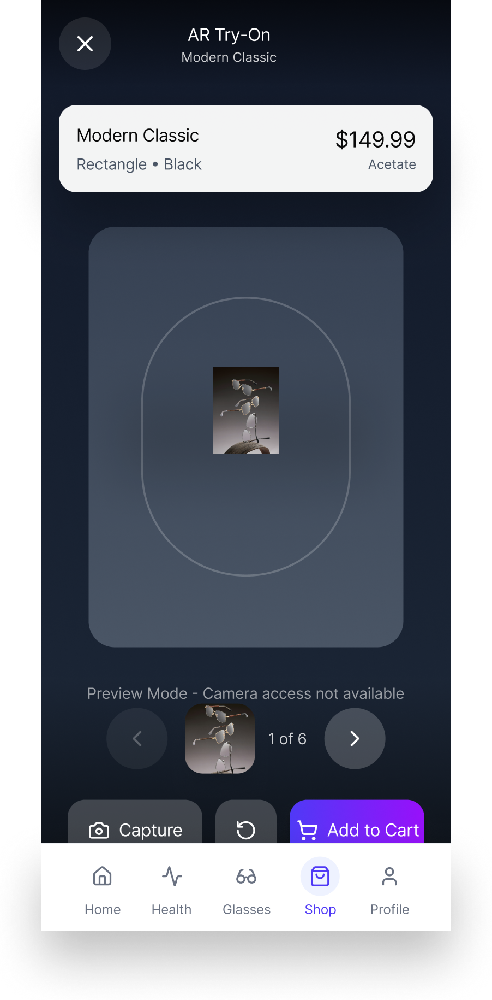

# TrueSight_App_Development_UI
__Feel free to interact with the TrueSight App runthrough__: https://crayon-nice-21061835.figma.site

The TrueSight companion app is a comprehensive eye-health management platform designed to interface with smart adaptive glasses. It transitions vision correction from a static hardware experience into a proactive, data-driven wellness journey.

__Core Platform Capabilities__: The app serves as the central hub for four primary functions: vision maintenance, health monitoring, professional connectivity, and retail.
* Adaptive Vision Management: The app manages smart lenses that automatically adjust their prescription over time to ensure consistent and reliable vision correction.
* Onboarding & Personalization: Upon setup, the app conducts a multi-step process to collect user data, including age, gender, and specific diagnosed conditions such as Myopia, Hyperopia, or Astigmatism to tailor health recommendations.
* Vision Dashboard: The interface provides a high-level view of vision stability, current prescription details for both eyes, and a progress bar showing the status of current lens adaptation.

__Health Tracking & Real-Time Metrics__: By syncing with the glasses via Bluetooth, the app provides deep analytics into daily visual habits.
* Real-time Biometrics: It tracks specific metrics including blink rate, eye strain levels, and total focus time.
* Optimal Habits: The app monitors "Screen Distance" to ensure users are viewing devices from an optimal range (e.g., 24 inches).
* Proactive Insights: The app generates behavioral notifications, such as "Take a break soon," after detecting prolonged screen usage.
* Health Scoring: Users receive a weekly average health score based on prescription accuracy, eye muscle health, and screen time trends.

__Clinical Integration__: A major pillar of the strategy is positioning the app as a "continuous monitoring" tool that bridges the gap between physical doctor visits.
* Remote Monitoring: Users can enable a "Remote Monitoring" feature that allows their optometrist to access eye health data securely from the comfort of the user's home.
* Appointment Management: The app syncs with clinical calendars to schedule annual exams or follow-ups and allows users to join video calls for prescription check-ins.
* Data Portability: Users can export their vision history, clinical notes, and tracking data as Text, JSON, or Printable HTML files to share with providers.

__Shopping & AR Features__: To combine style with technology, the app includes a retail component.
* Virtual Try-On: An AR (Augmented Reality) feature allows users to see how different frame styles—such as "Urban Chic" or "Professional"—look on their face before purchasing.
* Personalized Shop: The store highlights frames that are specifically compatible with the TrueSight adaptive lenses.

